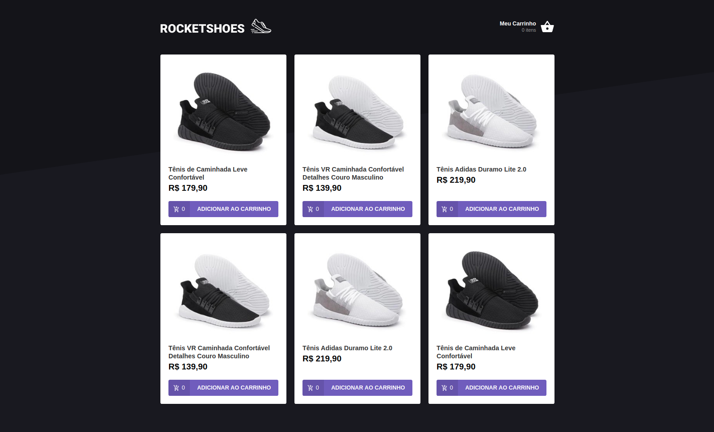
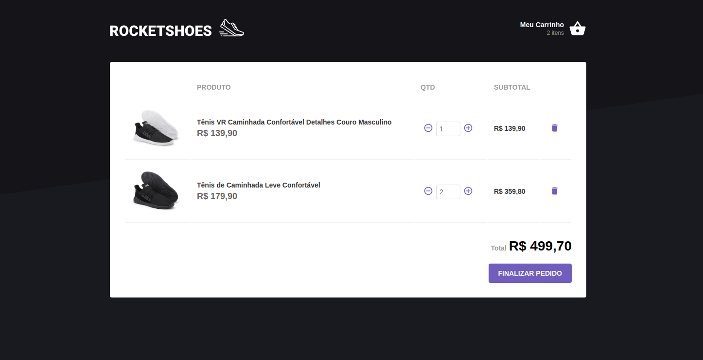

# Rocketshoes

---
### A simple ecommerce, using React and Redux

Project made to understand functionality of Redux and Redux Saga.

App structure:

- App
  - Redux
  - Header
      - Home
      - Cart


#### Here is  some images from project

###### Home Page



###### Cart Page



---

#### Try it for yourself

clone the project and run using Yarn:

Download all dependencies:

```bash
yarn
```
Run the project
```bash
yarn dev
```
or NPM

Download all dependencies
```bash
npm install
```
Run the project
```bash
npm run dev
```
This project uses a fake API, using json-server.

Run json-server without installing it
```bash
npx json-server -p 3333 server.json
```

server.json is a file in project root folder.

---

Francisco Silva / francisco.prosilva@gmail.com
